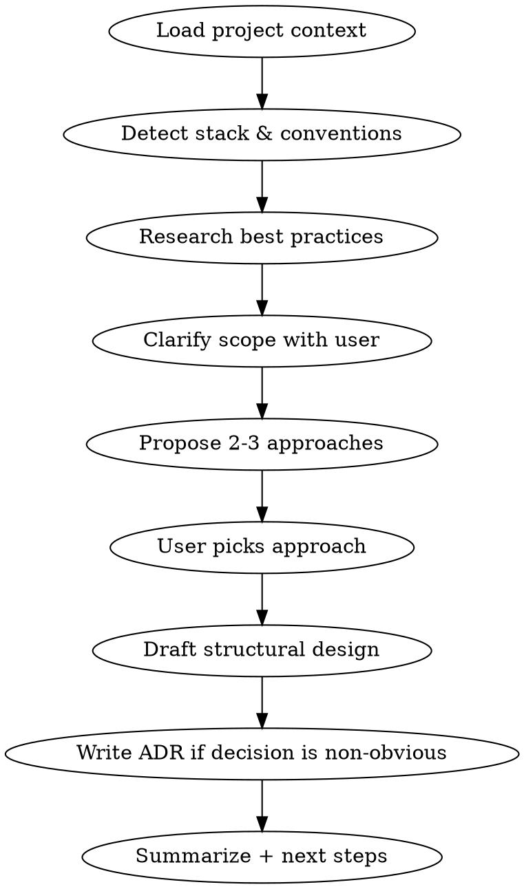

# Architecture Design (System Level)

Produce system-level architecture decisions: bounded contexts, module boundaries, layering, dependency flow. Output ADRs and diagrams only when they add value.

## Scope

**In scope:** domains, bounded contexts, modules, layers, dependency direction, integration boundaries, data ownership, cross-cutting concerns (auth, logging, events).

**Out of scope:** class structure, method signatures, design patterns inside a module (→ `component-design`), feature requirements or user stories, code-level bugs.

## Examples

```bash
# Design architecture for a new subsystem
/architecture-design order fulfillment module

# Design architecture for the whole project (exploratory)
/architecture-design
```

## Workflow



## Phase 1: Load Project Context

Check in order, stop at first hit:

1. `.agent-context/layer1-bootstrap.md` → tech stack, project identity
2. `.agent-context/layer2-project-core.md` → conventions, critical rules
3. `.agent-context/decisions.json` → existing architectural decisions (ADRs)
4. `CLAUDE.md`, `AGENTS.md`, `CONTRIBUTING.md`, `README.md`
5. Manifest files: `composer.json`, `package.json`, `go.mod`, `pom.xml`, `Cargo.toml`, `pyproject.toml`

If none exist, explore the top-level directory tree and infer stack from source extensions.

**Never block on missing context — always fall back to code exploration.**

## Phase 2: Detect Stack & Existing Structure

- Identify primary language(s), framework(s), and major libraries
- Map existing top-level modules/namespaces: `Glob` for `src/**`, `app/**`, `internal/**`, `pkg/**` depending on stack
- Detect architectural style already in use (layered, hexagonal, DDD, clean, modular monolith, microservices)
- Note build-system boundaries (monorepo packages, PHP namespaces, Go modules, etc.)

## Phase 3: Research Best Practices

Use `WebFetch` or available documentation tools (e.g., Context7) for up-to-date framework guidance. Examples:

- Symfony/Shopware → bundle vs. plugin boundaries, service layer
- Nuxt/Vue → server vs. client boundaries, composables, feature modules
- Go → package layout, internal/, hexagonal
- Spring → hexagonal + modulith

Do not rely on training data for framework conventions — fetch current docs when version matters.

## Phase 4: Clarify Scope

Ask targeted questions only if truly ambiguous. Preferred format: single multiple-choice per turn.

Typical open questions:

- Is this a new subsystem, a refactor, or a greenfield project?
- Hard constraints? (existing boundaries that must not change)
- Non-functional drivers? (team size, deploy target, scale, regulatory)

## Phase 5: Propose 2-3 Approaches

Present each with a one-line headline, a diagram sketch (Mermaid if helpful), and pro/kontra. End with **Empfehlung** and reasoning.

Typical dimensions to vary across options:

- Monolith vs. modular monolith vs. split services
- Domain-oriented vs. technical-layer-oriented module split
- Shared kernel vs. duplicated models across contexts
- Event-driven vs. direct calls between modules

## Phase 6: Draft Structural Design

After the user picks an approach, produce:

1. **Module/context map** — name, responsibility, owned data, public API surface
2. **Dependency direction** — which modules may depend on which (no cycles)
3. **Integration points** — events, sync calls, shared DB, etc.
4. **Cross-cutting concerns** — where auth, logging, validation live

Use a Mermaid `flowchart` or `graph` if it actually clarifies something. Skip it for trivial structures.

## Phase 7: ADR (Only If Warranted)

Write an ADR to `docs/architecture/adr/NNNN-<slug>.md` **only when** the decision:

- Rules out a reasonable alternative
- Has long-term consequences
- Other team members will later ask "why did we do it this way?"

Skip the ADR for obvious defaults. Template:

```markdown
# ADR-NNNN: <Title>

**Status:** Proposed | Accepted
**Date:** YYYY-MM-DD

## Context

<Forces, constraints, what problem this decision solves>

## Decision

<The chosen approach in 2-4 sentences>

## Consequences

**Positive:** ...
**Negative / Trade-offs:** ...
**Follow-ups:** ...

## Alternatives Considered

- **<Option B>** — rejected because ...
- **<Option C>** — rejected because ...
```

If `.agent-context/decisions.json` exists, also append a short entry there.

## Phase 8: Output Summary

Report in the user's language:

- What was decided
- Where the ADR/design doc lives (if written)
- Concrete next steps (often: run `component-design` on the first module)
- Risks or open questions the user still needs to resolve

## Rules

- **System-level only.** If the user pulls you into class-level detail, recommend `component-design`.
- **No feature planning.** If the request is about user stories or effort, redirect — not this skill.
- **Never modify source code.** Write only to `docs/architecture/` and optional `.agent-context/decisions.json`.
- **Respect existing structure.** Don't propose sweeping refactors unrelated to the current goal.
- **Fallback, don't block.** Missing Agent-Context layers → explore code instead.
- **Research current docs.** Don't guess framework conventions from memory.
