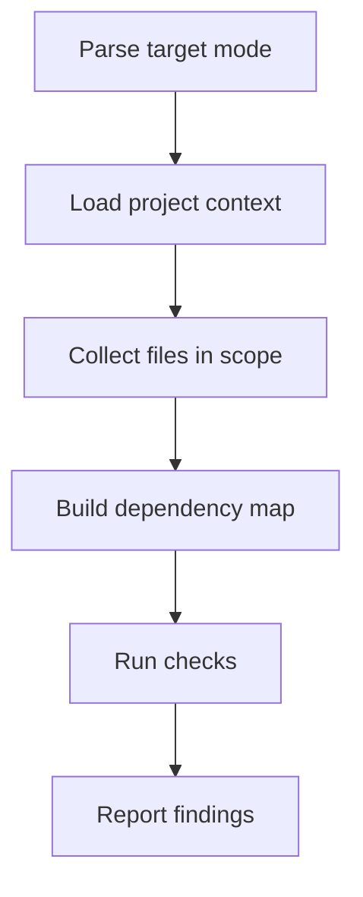

# Architecture Review (System Level)

Audit structural health: boundaries, dependency direction, layering, ADR drift. Report findings — never modify code.

## Scope

**In scope:** module/context boundaries, dependency cycles, layer violations, namespace cohesion, public-API surface leaks, shared-model pollution, drift from documented ADRs.

**Out of scope:** SOLID inside a class, naming of private methods, style, line-level bugs (→ `component-review` or general code review).

## Examples

```bash
# Review architecture of a specific PR
/architecture-review pr 42

# Review a branch against main
/architecture-review branch feat/orders-refactor

# Focus on a single namespace/module
/architecture-review namespace src/Order

# Review the whole project
/architecture-review
```

## Workflow



## Phase 1: Parse Target

From `$ARGUMENTS`:

- `pr <N>` → `gh pr diff <N>`, `gh pr view <N> --json headRefName,files`, read full file context via `git show <branch>:<file>`
- `branch <name>` → `git diff main...<name>`, `git ls-tree -r <name>`, read files via `git show <branch>:<file>`
- `namespace <path>` → recursively read files under `<path>`
- empty → full-project review (sample entry points + top-level modules)

## Phase 2: Load Project Context

Check in order:

1. `.agent-context/layer1-bootstrap.md`, `layer2-project-core.md`
2. `.agent-context/decisions.json` → ADRs that define intended structure
3. `docs/architecture/**/*.md`
4. `CLAUDE.md`, `AGENTS.md`, `CONTRIBUTING.md`
5. Manifest files for stack detection

Never block on missing context — infer from code layout.

## Phase 3: Build Dependency Map

Per detected stack, extract imports/uses:

- **PHP/Symfony/Shopware** → `use` statements, PSR-4 namespaces from `composer.json`
- **TypeScript/JavaScript/Vue/Nuxt** → `import` statements, path aliases from `tsconfig.json`/`nuxt.config`
- **Go** → `import` blocks, module path from `go.mod`
- **Java/Kotlin** → `import` + package declarations
- **Python** → `import`/`from`, top-level packages

Group imports by top-level module/namespace. Flag:

- Imports that cross declared module boundaries
- Imports going "upward" in a layered architecture
- Imports into another module's internal/private sub-path

## Phase 4: Architectural Checks

Run each relevant check and record findings with `file:line`:

### 1. Dependency Direction

- Layered: higher layers may import lower, never the reverse
- Hexagonal: adapters → ports → domain (never domain → adapters)
- Modular: module A imports only B's public API, never `internal/`

### 2. Circular Dependencies

- Build a module-level graph, detect cycles
- Even acceptable cycles should be listed as risks

### 3. Boundary Cohesion

- Does each module have a single clear responsibility?
- Public API surface: how many files/classes does an outside caller touch?
- "God module" symptom: one module imported by almost everything

### 4. Shared Model Pollution

- Domain entities reused across bounded contexts without translation
- Shared "Common" / "Util" module growing unbounded

### 5. ADR Drift

- For each ADR in `decisions.json` or `docs/architecture/adr/`: does the current code still match?
- Flag the specific ADR ID and the divergent file

### 6. Framework Convention Drift

- Use `WebFetch` / Context7 for current-version best practices when the stack version matters
- Example: Nuxt 3 server/client boundary, Symfony bundle structure, Go `internal/`

### 7. Cross-Cutting Concerns

- Is auth enforced at a single seam or scattered?
- Is logging/observability concentrated or repeated ad-hoc?

## Phase 5: Report

Output in the user's language. Structure:

```markdown
## Architecture Review — <scope>

**Risk Level:** LOW | MEDIUM | HIGH | CRITICAL
**Detected stack:** <stack>
**Checks run:** <list>

## Critical (must fix)

- **<Title>** — `path/to/file:line`
  - Problem: <what>
  - Why it matters: <impact>
  - Suggested direction: <high-level fix, not code>

## Warnings (should fix)

- ...

## Observations (worth knowing)

- ...

## ADR Compliance

| ADR                   | Status      | Notes                              |
| --------------------- | ----------- | ---------------------------------- |
| ADR-0003 Hexagonal    | ✅ ok       |                                    |
| ADR-0007 No shared DB | ⚠️ drifting | `OrderRepo` touches billing tables |

## Suggested Next Steps

1. ...
2. ...
```

## Rules

- **Read-only.** Never modify source files. Findings are reports.
- **Structural focus.** If the only findings are code-quality issues, recommend `component-review` instead.
- **Evidence-based.** Every finding needs a concrete `file:line` reference.
- **Prioritize.** Not every boundary leak is critical — severity matters more than count.
- **Fallback, don't block.** Missing ADRs or context layers → infer intent from code layout.
- **Ignore style.** Linters and formatters own that territory.
