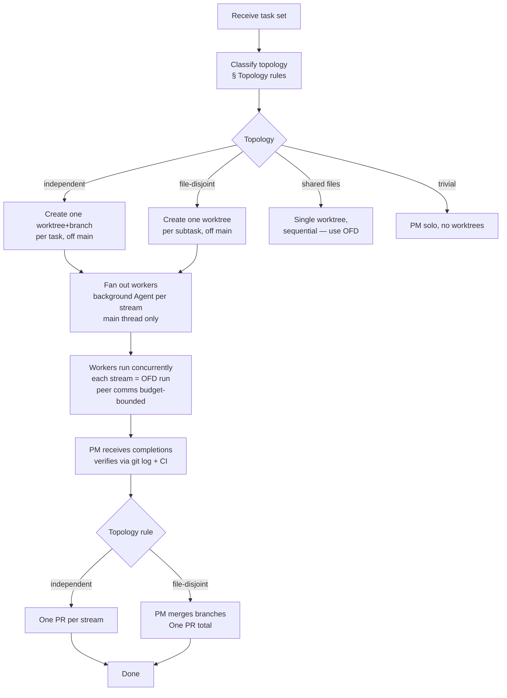

# Agent-Team Operating Model (ATOM)

Structured PM coordination for non-trivial parallel work: one coordinating main-thread PM, multiple isolated worker agents, each in its own git worktree.

## Scope

**DOES:**

- Act as PM: decide topology, create worktrees off `main`, fan out workers, govern peer comms, own merge and conflict resolution
- Choose the correct worktree topology based on task structure (see Topology rules below)
- Dispatch parallel worker streams via background `Agent` calls (main thread only)
- Govern peer-to-peer communication between workers (contracts-first, budget-bounded)
- Integrate results per the topology rule; verify via `git log` and CI

**Does NOT:**

- Handle trivial single-step tasks (≤1 tool call) — those stay with the coordinator directly
- Replace OFD: a single worker stream is itself an OFD run; ATOM is the layer above that distributes streams
- Implement the dashboard's native PM-agent feature (Plane B) — this skill governs interactive sessions only

## When it triggers

The global rule is the trigger: **delegate when >1 tool call; the coordinator stays a lean PM.** Any time work decomposes into multiple independently executable streams — code, docs, analysis, or mixed — load this skill and choose a topology before dispatching.

## Examples

```bash
# Three independent tasks dispatched in parallel, each gets its own PR
/atom-operating-model "implement A, B, C (independent)"
```

```bash
# One feature split file-disjointly across two agents, merged into one PR
/atom-operating-model "split the checkout refactor: agent 1 owns src/checkout/, agent 2 owns src/payment/"
```

Inline form:

> "Act as PM for these three independent tasks and fan them out across worktrees."

## Workflow



## Topology rules

| Situation | Topology |
| --- | --- |
| Multiple **independent** features/tasks (no file overlap, no dependency) | One worktree+branch each, parallel → **one PR each** |
| **One** feature split into **file-disjoint** subtasks | One worktree each, parallel → PM merges branches → **one PR** |
| One feature, shared files / tight coupling | **Sequential, single worktree** (this is OFD) |
| Trivial (≤1 tool call) | PM solo — no worktrees, no fan-out |

Worktrees are always created manually off `main` — never via the `Agent` `isolation:'worktree'` flag (that forks from `origin/main` and is not suited to multi-stream coordination).

## Execution context

> **Critical boundary — read before spawning anything.**

| Context | Allowed mesh |
| --- | --- |
| **Interactive Claude Code session** (PM = main thread) | Full mesh: background `Agent` workers + completion notifications + peer `SendMessage` |
| **Headless / spawned agent** (e.g. a dashboard stage agent) | Synchronous subset only: dispatch children foreground, no background-wait |

A spawned `claude` process is **not reliably re-woken**, so it must never run the background mesh — doing so stalls the agent tree. This means the dashboard's Plane B PM role belongs to the pipeline/orchestrator engine, not to a spawned stage agent.

## Principles

- The PM never does the bulk work; it coordinates, decides, and integrates only.
- Worktrees are always created manually off `main`; never use the `Agent isolation:'worktree'` flag for ATOM streams.
- Only the main-thread PM uses background dispatch + completion notifications; workers dispatch their own children synchronously (foreground).
- Verify worker outcomes via `git log` and CI — never trust a worker's prose report alone.
- Establish shared contracts (types, API signatures) before starting file-disjoint fan-out, so mid-run coordination is the exception.
- Peer comms are allowed and encouraged, but budget-bounded (max N round-trips, then escalate to PM); "progress before talk" — a worker may not only communicate without delivering.
- The PM owns all scope, merge, conflict-resolution, and abort decisions.

## Related skills

- `superpowers:subagent-driven-development` — single-stream delegation pattern that each worker stream follows
- `superpowers:dispatching-parallel-agents` — background fan-out mechanics and completion-notification handling
- `superpowers:using-git-worktrees` — manual worktree creation, branch setup, and teardown
- `runbook.md` (same folder) — topology rules detail, mesh mechanics, depth limit, integration steps
- `comms-protocol.md` (same folder) — peer rules, PM authority, contracts-first protocol, anti-loop guards

Paths this skill may create: feature worktrees beside the repo root, and pull requests for each completed stream.
