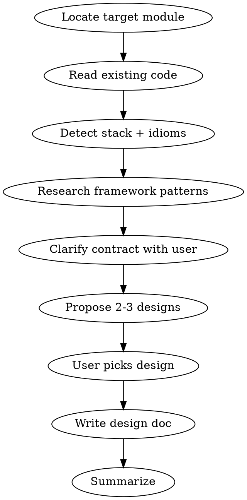

# Component Design (Detail Level)

Design the internals of one module: classes, interfaces, patterns, method contracts. Output a design doc plus optional diagrams when they earn their place.

## Scope

**In scope:** class responsibilities, interfaces/abstract types, design patterns (Strategy, Factory, Adapter, …), aggregate roots and invariants, method signatures, collaboration, data-shape contracts, testability seams.

**Out of scope:** module/context boundaries (→ `architecture-design`), feature requirements, infrastructure choices outside the module.

## Examples

```bash
# Design a specific component
/component-design OrderService

# Design a new component from scratch
/component-design payment-retry handler
```

## Workflow



## Phase 1: Locate the Target

From `$ARGUMENTS`, find the module via `Glob` / `Grep`. If nothing matches, ask the user to confirm path/name.

Always read **at minimum**:

- The target module's current files (or parent directory if new)
- Nearby sibling modules for convention parity
- Existing tests — they reveal the real contract

## Phase 2: Detect Stack & Idioms

- Language, framework, version
- Framework-native building blocks (Symfony services, Nuxt composables, Go packages, Spring beans, NestJS providers)
- DI container style, preferred error handling, validation approach
- Existing patterns in the codebase — match them unless there is a reason not to

## Phase 3: Research Current Best Practices

Use `WebFetch` or Context7 for version-specific guidance. Examples of what NOT to guess:

- Symfony autowiring and attribute-based config
- Vue 3 Composition API + `<script setup>` patterns
- Go generics and error wrapping idioms
- Java records, sealed interfaces, pattern matching

## Phase 4: Clarify Contract

Ask one focused question at a time when genuinely ambiguous:

- What are the **inputs and outputs**?
- What are the **invariants** (things that must always hold)?
- What **errors** can occur, and how should callers learn about them?
- What **side effects** exist (DB writes, events, external calls)?
- What **needs to be mockable** for tests?

Skip questions you can answer from code.

## Phase 5: Propose 2-3 Designs

Each proposal contains:

- **Shape:** classes/interfaces/functions + their responsibilities (one sentence each)
- **Collaboration:** who calls whom (Mermaid sequence or class diagram, only if it clarifies)
- **Pattern:** named pattern if applicable (Strategy, Template Method, Adapter, Ports & Adapters, …)
- **Trade-offs:** testability, extensibility, complexity cost
- **Effort:** rough gut feel, not estimates

End with **Empfehlung** and reason.

Typical axes to vary:

- Rich domain model vs. anemic + service
- Inheritance vs. composition / Strategy
- Single aggregate vs. split aggregates
- Sync vs. async (events) for side effects
- One large service vs. small focused services

## Phase 6: Produce the Design Doc

Write to `docs/architecture/components/<module>-design.md` **only when** the design is non-trivial (≥3 classes, or a pattern worth recording). Skip the file for tiny designs and answer inline.

Template:

````markdown
# Component Design: <Name>

**Module:** `<namespace/path>`
**Date:** YYYY-MM-DD
**Related ADR:** <id or none>

## Purpose

<1-2 sentences: what this component is responsible for>

## Public API

```<lang>
// signatures of what callers use
```

## Internal Structure

- **<Class>** — <responsibility>
- **<Interface>** — <purpose, implementations>

## Collaboration

<mermaid diagram OR short prose — only if it clarifies>

## Invariants

- <Rule that must always hold>

## Error Model

- <Error type> → <how callers handle>

## Testability Seams

- <What is mocked/faked and why>

## Alternatives Considered

- <Alt> — rejected because …
````

## Phase 7: Summary

Report in the user's language:

- Chosen shape in one sentence
- Where the doc lives (if written)
- Suggested next step (usually: implement + TDD, or run `component-review` after implementation)

## Rules

- **Detail level only.** If the request is really about module boundaries, redirect to `architecture-design`.
- **Match existing idioms.** Don't introduce a new pattern if the codebase already has one that fits.
- **Never modify source code.** Write only to `docs/architecture/components/`.
- **Research, don't guess.** Fetch current framework docs when the version matters.
- **YAGNI.** Don't design for hypothetical future extensions. One concrete use case is enough.
- **Diagrams optional.** Only include one if a sentence wouldn't be clearer.
