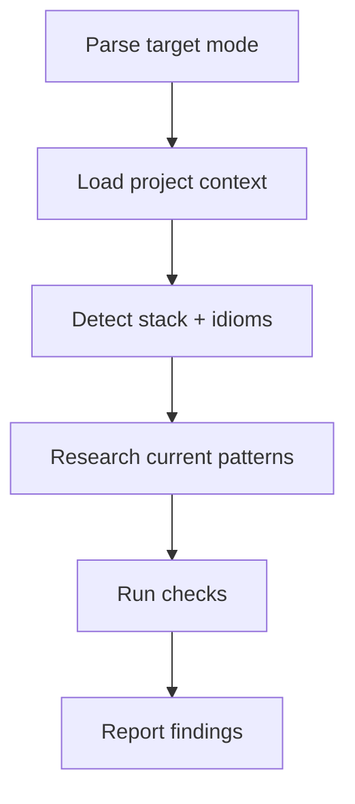

# Component Review (Detail Level)

Audit class- and method-level design of a scoped target. Report findings — never modify code.

## Scope

**In scope:** SOLID (per class), cohesion inside a class, pattern correctness, interface segregation, method signatures, aggregate invariants, error model, testability seams, naming that leaks abstractions.

**Out of scope:** module boundaries, dependency cycles, layer violations (→ `architecture-review`), code formatting, style, line-level null checks.

## Examples

```bash
# Review a PR's component design
/component-review pr 42

# Review a branch
/component-review branch feat/order-service

# Review a specific namespace/module
/component-review namespace src/Order

# Review current uncommitted changes
/component-review
```

## Workflow



## Phase 1: Parse Target

From `$ARGUMENTS`:

- `pr <N>` → `gh pr diff <N>`, `gh pr view <N> --json headRefName,files`, read files via `git show <branch>:<file>`
- `branch <name>` → `git diff main...<name>`, read files from branch
- `namespace <path>` → recursive read under `<path>`
- empty → `git diff HEAD` for uncommitted changes

## Phase 2: Load Project Context

Check in order, stop at first hit:

1. `.agent-context/layer1-bootstrap.md`, `layer2-project-core.md`
2. `.agent-context/decisions.json` → ADRs that constrain class design
3. `docs/architecture/**/*.md`
4. `CLAUDE.md`, `AGENTS.md`, `CONTRIBUTING.md`
5. Manifest files for stack detection

Never block on missing context — infer from surrounding code.

## Phase 3: Detect Stack & Idioms

- Language, framework, version from manifests
- Existing patterns in surrounding files — the review baseline is the codebase's own conventions, not abstract ideals
- Read nearby tests to understand the real contract

## Phase 4: Research Current Best Practices

Use `WebFetch` or Context7 for version-sensitive rules:

- Framework DI and lifecycle (Symfony, Spring, NestJS)
- Language-specific idioms (Go error wrapping, Rust ownership, Vue Composition API, Java sealed types)

Don't apply generic OO dogma if the ecosystem has moved on.

## Phase 5: Checks

Run each relevant check and record findings with `file:line`:

### 1. Single Responsibility (per class)

- Can you describe the class in one sentence without "and"?
- Are private methods clearly serving one public contract?

### 2. Open/Closed & Extensibility

- Are new variants added via new types, or by editing the same class?
- Flag `switch` on type tags or string enums that will keep growing.

### 3. Liskov & Interface Segregation

- Do subclasses honor the parent contract (no surprise throws, no empty overrides)?
- Are interfaces narrow enough that callers only depend on what they use?

### 4. Dependency Inversion

- Are collaborators injected, or instantiated with `new`?
- Are infrastructure concerns leaking into domain classes?

### 5. Pattern Correctness

- If a named pattern is used, is it used correctly? (Strategy without behavior variation = not a Strategy)
- Is there a simpler pattern or plain function that would do?

### 6. Cohesion Inside a Class

- Fields only used by some methods → hint of hidden class
- Temporal coupling (must call A before B) → signal for missing abstraction

### 7. Method Signatures

- Boolean flags that toggle behavior → two methods instead
- Primitive obsession → candidate for a value object
- Output parameters, tuple returns that should be a type

### 8. Aggregate / Invariant Integrity

- Can domain invariants be violated by calling methods in a legal order?
- Are mutations funneled through the aggregate root?

### 9. Error Model

- Exceptions vs. result types — consistent with the codebase?
- Are errors silently swallowed or generically re-thrown?

### 10. Testability Seams

- Can the class be tested without patching globals or network?
- Are seams (ports, factories) at sensible places?

### 11. Naming That Leaks

- Names that reveal the wrong abstraction (`OrderManager`, `UserUtil`, `DataHelper`) → symptom of unclear responsibility

## Phase 6: Report

Output in the user's language:

```markdown
## Component Review — <scope>

**Risk Level:** LOW | MEDIUM | HIGH | CRITICAL
**Detected stack:** <stack>
**Files reviewed:** <N>

## Critical (must fix)

- **<Title>** — `path/to/file.ext:line`
  - Problem: <what is wrong>
  - Principle: <SRP / LSP / DIP / …>
  - Suggested direction: <high-level fix, not code>

## Warnings (should fix)

- ...

## Suggestions (nice to have)

- ...

## Patterns Observed

- <Pattern> — used correctly / misused / missing

## Suggested Next Steps

1. ...
2. ...
```

## Rules

- **Read-only.** Never modify source files.
- **Detail level only.** If the findings are really about module boundaries, recommend `architecture-review`.
- **Evidence-based.** Every finding needs a concrete `file:line` reference.
- **Respect local idioms.** Match the codebase's existing style — don't import dogma from another ecosystem.
- **Severity over volume.** Fewer high-signal findings beat many nitpicks.
- **Ignore style.** Linters and formatters own formatting.
- **Fallback, don't block.** Missing context layers → infer from code.
