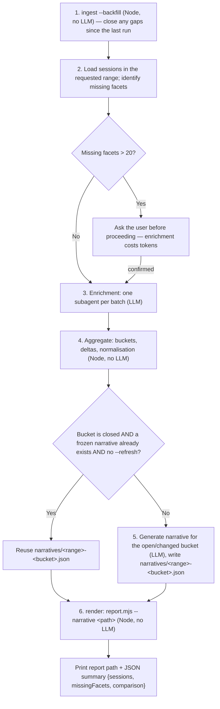

# Insights History

Turn Claude Code session history into a durable, arbitrary-range usage report with trend and period-over-period comparison — the built-in `/insights` can't do either, and loses everything older than the retention window.

## Scope

**In**

- Reporting over any time range: all time, `--last`, `--since`/`--until`, or an explicit `--compare A vs B`.
- Week- or month-over-month trend buckets, always present, with absolute and per-session/per-commit normalised figures.
- A durable local archive (`~/.claude/usage-data/archive/`) that outlives the transcript retention policy (`cleanupPeriodDays`, default 30 days), so history captured once is never lost to cleanup again.
- Filling in missing per-session quality facets (outcome, friction, helpfulness) so reports aren't capped at whatever the built-in has already extracted.

**Out**

- Recovering sessions whose transcript was already deleted before the ingest hook was installed. This is not a technical limitation to work around — the data is gone. See **Data limits and trust** below.
- Replacing `/insights`. That command stays the single-shot "how am I doing lately" view; this skill is the historical, comparable one. Both read and write the same `session-meta/` and `facets/` caches, deliberately, so neither re-does the other's work.
- Per-repo or per-project scoped reports — project mix is a reported dimension, not a filter. Usage data is global by design.
- Team or multi-machine aggregation.

## Examples

```bash
# All-time report, bucket granularity chosen automatically (week ≤90 days, month above)
/insights-history
```

```bash
# Explicit month-over-month comparison with a delta section
/insights-history --compare 2026-06 vs 2026-07
```

```bash
# Rolling 90-day window, weekly buckets
/insights-history --last 90d --by week
```

```bash
# Install the SessionEnd hook so future sessions are captured automatically —
# shows the settings.json diff and asks for confirmation before writing anything
/insights-history --install-hook
```

## Invocation

No arguments: full range, all sessions ever ingested. `--compare A vs B` additionally renders an explicit delta block for two named periods spanning the full comparison range.

Period tokens, accepted identically by `--since`, `--until`, and both sides of `--compare`:

| Token                  | Example      | Resolves to                     |
| ---------------------- | ------------ | ------------------------------- |
| `YYYY-MM-DD`           | `2026-06-01` | that day, 00:00 local           |
| `YYYY-MM`              | `2026-06`    | that calendar month             |
| `YYYY-Www`             | `2026-W26`   | that ISO week                   |
| `<N>d`, `<N>w`, `<N>m` | `90d`        | relative to now — `--last` only |

Ranges are inclusive at both ends. An unparsable token is a hard error naming the accepted forms (exit 2, message on stderr) — never a silent fallback to the full range, which would produce a plausible-looking but wrong report. An empty data root (nothing ingested yet) exits 1 with a message telling the user to run the backfill first.

## Workflow



Steps 1, 2, 4, and 6 are deterministic and repeatable — running them twice on the same data produces byte-identical output. Only steps 3 and 5 cost tokens, and both cache their results so a re-run over unchanged data is free.

### Step 1 — close ingest gaps

```bash
node skills/insights-history/scripts/ingest.mjs --backfill
```

Always run this first, even if the hook is installed — it catches anything the hook missed (crash, hook disabled, a Claude Code upgrade, another machine). Idempotent: sessions already up to date are skipped by comparing `transcript_mtime`.

### Step 2 — identify missing facets

Load `session-meta/` and `facets/` for the requested range (`report.mjs` does this natively; the skill needs the same session list before deciding whether enrichment is needed). A session is a facet candidate only if it also passes the report-time filter (`user_message_count >= 2 && duration_minutes >= 1`, not `warmup_minimal`-only) — sessions the report would exclude anyway are not worth enriching.

### Step 3 — enrichment (see **Enrichment rules** below)

### Step 4 — aggregate

Deterministic, native. No model involvement — see `lib/aggregate.mjs`.

### Step 5 — narrative (see **Narrative freezing** below)

### Step 6 — render

```bash
node skills/insights-history/scripts/report.mjs --last 90d --by week --narrative <narrative-path>
```

`report.mjs` prints the report path on the first stdout line and a JSON summary `{sessions, missingFacets, comparison}` on the second. Relay both to the user: the path so they can open the HTML report, and `missingFacets`/`comparison` so they know whether the numbers are complete. `report.mjs` **never calls a model** — narrative prose is generated by the skill beforehand and handed in via `--narrative`, never produced inline by the render step.

## Output format

Two outputs per run:

**HTML report**, self-contained (no external assets, light and dark theme), written to `~/.claude/usage-data/reports/`:

- `history-<start>_<end>-<timestamp>.html` — one per run, never overwritten.
- `latest.html` — always the most recent run's report, overwritten each time.

**stdout**, two lines, machine-parseable:

```
<absolute path to the timestamped report>
{"sessions": <int>, "missingFacets": [<session_id>, ...], "comparison": <object|null>}
```

`comparison` is `null` unless `--compare` was given, in which case it is `{ before, after, change }` with `change` carrying signed absolute and percentage deltas per metric. Exit codes: `0` on success, `1` when the data root has no session metadata at all (nothing ingested yet), `2` for any unparsable period token or an inverted range (`--since` after `--until`).

## Enrichment rules

Sessions lacking a facet are assessed from their slim archive (`archive/<id>.slim.jsonl.gz`) using the same field shape and enum categories the built-in tool itself uses — see `references/builtin-schema.md` for the exact facet object shape to produce.

- **Cost gate, always.** Count sessions missing a facet in the requested range and state the number before doing anything else. Above **20** missing sessions, ask the user for confirmation before starting — enrichment costs real tokens and the user should decide whether that trade is worth it for this report.
- **One subagent per batch.** Never inline slim transcripts into the main context — a batch of missing sessions goes to a subagent (`Agent` tool), which reads the slim archives, extracts facets in the built-in's shape, and returns structured JSON. The main thread stays clean regardless of how many sessions are missing.
- **Oversized sessions get chunk-summarised first.** A slim transcript large enough to threaten a subagent's context budget is chunk-summarised before facet extraction — the same two-stage approach the built-in uses (`_Ly` chunk-summarise → `vLy` facet extraction) rather than truncating or skipping it.
- **Write results immediately.** Each returned facet is written to `facets/<id>.json` as it comes back, not batched until the end — a crash partway through still leaves completed work durable.

## Narrative freezing

Prose describing a **closed** bucket (a week or month that has fully elapsed) is generated once, written to `narratives/<range>-<bucket>.json`, and reused on every subsequent run over that data. Only the **current, still-open** bucket is regenerated each time the skill runs. `--refresh` overrides this and forces regeneration of every bucket in range.

Why: two runs over identical closed-period data would otherwise produce different prose on every invocation, making it impossible to tell whether the user's working pattern changed or only the sampling did. This does not affect facets — those are per-session and permanent once written, closed-bucket or not.

The cost of freezing: a frozen narrative cannot reference what happened later. A June paragraph can't say "this settled down in July." The comparison delta section is therefore always regenerated in full on every `--compare` run — it is not subject to freezing.

The skill, not `report.mjs`, writes `narratives/<range>-<bucket>.json` and generates its contents. `report.mjs` only reads whatever path is passed via `--narrative` and never invokes a model itself — this keeps the one script that touches every report deterministic and testable.

## Write-skill declaration

This is a **write skill** (STYLEGUIDE §5). Every path it creates or edits:

| Path | Written when | Confirmation required? |
| --- | --- | --- |
| `~/.claude/usage-data/session-meta/*.json` | every run (ingest + backfill) | no |
| `~/.claude/usage-data/archive/*.slim.jsonl.gz` | every run (ingest + backfill) | no |
| `~/.claude/usage-data/facets/*.json` | enrichment, when facets are missing | no (the ≥20 count gate above covers cost, not a write confirmation) |
| `~/.claude/usage-data/narratives/*.json` | narrative step, for closed buckets not already frozen (or any bucket with `--refresh`) | no |
| `~/.claude/usage-data/reports/*.html` | render step, every run | no |
| `~/.claude/scripts/insights-ingest.mjs` | **only** under `--install-hook` | yes — shown before writing |
| `~/.claude/settings.json` | **only** under `--install-hook` | yes — diff shown before writing |

Nothing is ever written into the repository, and nothing is ever written into `~/.claude/projects/` (that directory is the transcript source and is read-only from this skill's perspective). See `references/ingest-hook.md` for the exact `--install-hook` sequence and the reasoning behind gating it on explicit confirmation.

## Data limits and trust

State these plainly to the user whenever they're relevant — they are not fine print.

- **History before the ingest hook is installed cannot be recovered.** Transcript retention deletes the source `.jsonl` files (default `cleanupPeriodDays`: 30), and once a transcript is gone, no amount of re-running ingest brings its data back. Day zero for this skill's archive is the day the hook is installed (or the day `--backfill` first runs against still-present transcripts) — not any earlier.
- **Metadata parity with the built-in is measured, not perfect.** Currently **0.91** on `user_message_count` and `assistant_message_count`, **0.94** on `tool_counts`, and **0.99** on tool-error counts, measured across 34 comparable real sessions. The known cause — transcripts with resume/compaction history containing abandoned branches that a naive full-file scan over-counts — is documented in detail, including a rejected fix attempt and why it made things worse, in `references/parity-harness.md`. Do not present these numbers as exact; they are a real, currently-measured floor.
- **Friction categories are an unvalidated, model-generated field.** The built-in's own facet validator checks types, not enum membership, so the model is free to invent friction labels beyond the ~13 known ones, and it does — see `references/builtin-schema.md` for the observed vocabulary. The report's **Ad-hoc vocabulary** column in the Quality table shows what share of each bucket's friction events rest on invented (unrecognised) categories, so a reader can judge how much of that column to trust per bucket rather than treating it as uniformly solid.

## Principles

- Never write into the repository. Everything this skill produces lives under `~/.claude/usage-data/` or, for the hook install, `~/.claude/scripts/` and `~/.claude/settings.json`.
- Never modify `~/.claude/projects/` — that is the transcript source of truth and is read-only from this skill's perspective.
- Never patch `~/.claude/settings.json` without showing the diff first and receiving explicit confirmation. No exceptions, no "it's just adding one hook."
- Report a period with missing facets as **incomplete**, never silently under-report it. Always surface `missingFacets` from the JSON summary to the user, even when it's empty (say so explicitly) — a report that quietly excludes unfaceted sessions from its quality tallies without saying so is worse than one that says plainly "N sessions in this range have no quality data yet."
- Code counts, the model interprets. Deterministic steps (ingest, aggregate, render) never call a model; the two steps that do (enrichment, narrative) are the only ones that cost tokens and the only ones this skill asks about or caches.

## Related skills

- `/session-handoff` — the other reporting skill in this repo; writes to `outputs/` because its data is per-session and repo-scoped, whereas this skill writes globally under `~/.claude/` because usage data spans every project.
- `/oss-readiness` — precedent for skill-local `references/` and for gating a state-mutating flag (`--apply-fixes` there, `--install-hook` here) behind explicit confirmation rather than inferring consent.
