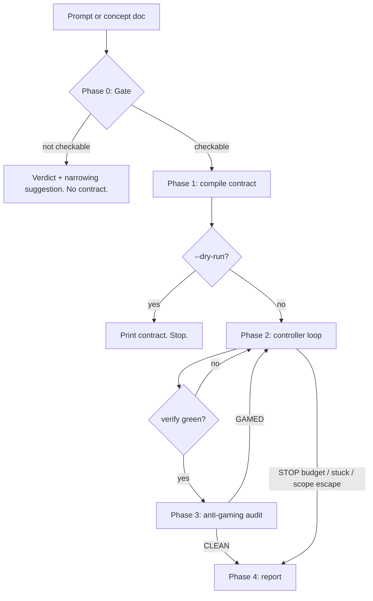

# Loop Contract

Turn a prompt — or a whole concept document — into an explicit loop contract, then execute it autonomously until the contract is satisfied or a budget is exhausted.

**Language:** contract and report follow the language of the user's request. Commit messages, code, and the contract's machine-readable fields stay English.

**This skill writes code.** It edits the working tree inside declared scope fences. It never commits, never pushes, never reverts.

## Control discipline (top-level rule)

**The controller script decides, not you.** Every continue/stop decision comes from `${CLAUDE_SKILL_DIR}/scripts/loop-state.sh`. You spawn workers, run verify commands, and report outcomes to the script. You never conclude "this looks done" or "one more attempt should fix it" — you execute the directive the script prints. Most subcommands print exactly one directive line; `next` in Plan-Mode is the exception — it may print zero or more informational `ITEM` lines (items auto-blocked by a spent per-item budget) before its terminal `SPAWN` or `STOP` line. Keep reading output until a `SPAWN`, `STOP`, or `CONTINUE` line appears.

| Directive | What you do |
| --- | --- |
| `SPAWN …` | dispatch one fresh worker subagent for that iteration/item |
| `AUDIT …` | dispatch the anti-gaming auditor, then report its verdict |
| `ITEM …` | informational only — an item was auto-blocked, marked, or resolved; no action required, keep reading |
| `CONTINUE …` | call `next` again |
| `STOP reason=…` | stop immediately and write the report; a repeated `STOP` from `record`/`audit` on an already-stopped run is terminal, not a new event |
| `SCOPE escape …` | Goal-Mode: the whole run stops (`STOP reason=scope-escape`). Plan-Mode: the current item is blocked and the run continues (`ITEM item=N state=blocked reason=scope-escape`) |

This is a standing rule for the entire run, not a one-time step. The reason is structural: a model asked to judge its own progress will keep retrying a failed action, which is the runaway-loop failure mode this skill exists to prevent.

## Scope

**DOES:**

- Compile a prompt or concept/plan document into a machine-checkable contract.
- Refuse to loop when no checkable done-state exists.
- Run the loop: one fresh worker per iteration or item, deterministic budgets, anti-gaming audit.
- Report what completed, what is blocked, and what was never automatable.

**DOES NOT:**

- Time-based or recurring execution → `/loop <interval>`, `/schedule`.
- Parallel streams or worktree topology → `/atom-operating-model`.
- Judge the quality of the resulting diff → `/branch-review`.
- Write the plan itself → `superpowers:writing-plans` produces plans; this skill executes one.

## Examples

```bash
# Goal-Mode: single checkable goal
/loop-contract entferne alle fetch() calls aus src/, tests müssen grün bleiben

# Plan-Mode: hand over a concept document
/loop-contract docs/superpowers/plans/2026-07-26-di-migration.md

# Inspect the contract without running it
/loop-contract --dry-run migrate every controller to constructor injection

# Raise the global budget for a large concept
/loop-contract docs/plans/big-refactor.md --max-iterations 80
```

## Entry paths

| Entry                                         | Behaviour                                                    |
| --------------------------------------------- | ------------------------------------------------------------ |
| Explicit (`/loop-contract …`)                 | Gate → print contract → **start immediately**                |
| Auto-triggered (matched from a normal prompt) | Gate → print contract → **ask once** → start on confirmation |

An explicit invocation is the consent. An auto-trigger is not: the user did not ask for a loop, so the printed contract plus one `AskUserQuestion` confirmation replaces the review window. Never skip that confirmation on the auto-triggered path.

## Flow



## Phase 0 — Gate

Three checks. Run them before writing anything.

1. **Done-state expressible** — can a shell command be written whose exit code decides the goal?
2. **Progress signal exists** — does something observable change between rounds (failure count, grep hits, items resolved)?
3. **Scope boundable** — can allowed paths be named?

**On failure: no contract, no loop.** Emit the verdict, which check failed, and a concrete narrowing suggestion:

```
VERDICT: not loop-suitable
  ✗ no machine-checkable done-state
  ✗ no progress signal (subjective quality)
No contract written.
Suggest: single-pass + human review, or narrow to "lighthouse a11y score >= 95".
```

Do not soften this into a proxy contract. The Gate is the only runaway defence before execution starts.

**Mode selection:** a document path, or a prompt containing a numbered/checkboxed item list → **Plan-Mode**. Anything else → **Goal-Mode**.

**Plan-Mode applies check 1 per item, not to the plan as a whole:**

- Item has (or implies) a verify command → normal item.
- Item has no command but a structural check exists (file exists, file contains a heading, symbol present) → that becomes its verify.
- Neither → mark the item `manual`. It is never executed and appears in the report as a human todo.

Enter Plan-Mode if at least one item is verifiable. Reject the plan only if every item is `manual`.

## Phase 1 — Compile the contract

Probe the repo before writing the contract: detect the test runner, linter, and build command from `package.json`, `composer.json`, `pyproject.toml`, `Makefile`, or `go.mod`. Never invent a verify command that the project cannot run — run it once, before the loop starts, to confirm it executes at all. A verify command that errors on invocation (rather than failing) is a broken contract, not a red goal.

Write to `outputs/loop-contracts/<slug>.md` (`mkdir -p` first). Full schema and worked examples: [references/contract-schema.md](references/contract-schema.md).

**Print the complete contract before spawning the first worker.** It must be in the transcript so the run is interruptible.

**If `--dry-run` was passed, stop here.** Print the contract and return — do not initialise the controller.

Otherwise, initialise the controller:

```bash
# Goal-Mode
${CLAUDE_SKILL_DIR}/scripts/loop-state.sh init --state outputs/loop-contracts/<slug>.state \
  --mode goal --max-iterations 8 --no-progress 2

# Plan-Mode
${CLAUDE_SKILL_DIR}/scripts/loop-state.sh init --state outputs/loop-contracts/<slug>.state \
  --mode plan --per-item 3 --global 40 --items 1,2,3,4
```

`--global` above sets the Plan-Mode run budget on `init`; it is a different flag from `--global-audit`, which the final run-level audit in Phase 3 uses.

Mark unverifiable items immediately:

```bash
loop-state.sh mark --state <state> --item 3 --state-value manual
```

`--max-iterations N` from the user overrides `--max-iterations` (Goal-Mode) or `--global` (Plan-Mode).

## Phase 2 — Run the loop

Preconditions, checked once: not on `main`/`master`/`develop` (abort with a hint), and the verify command executes.

**Resuming an interrupted run:** if `outputs/loop-contracts/<slug>.state` already exists with `status=running`, call `next` on it directly — do not re-run `init`. `init` refuses an existing running state unless `--force` is passed, precisely because re-initialising would silently reset the global budget to zero; `--force` is only for deliberately discarding a run and starting over.

Repeat until the script prints `STOP`:

```bash
loop-state.sh next --state <state>
```

**On `SPAWN`:** dispatch exactly one worker subagent via the Agent tool. Give it: the contract, the item (Plan-Mode), the previous failure output, and the scope fences. Tell it explicitly that it may only touch `scope-allow` paths and must not weaken tests or configuration. Do not carry conversation history into the worker — the fresh context is the point.

**After the worker returns**, in this order:

```bash
# Goal-Mode: --allow is the contract's global scope-allow.
loop-state.sh scope-check --state <state> --allow "src/**,tests/**" --deny "src/vendor/**"

# Plan-Mode: --allow is the CURRENT ITEM's scope-allow, not a global fence.
# --item is required so an escape can be recorded against that item.
loop-state.sh scope-check --state <state> --allow "src/user/**,tests/user/**" --deny "src/vendor/**" --item <id>
```

Always pass `--deny` with the contract's current `scope-deny`. Appending to `scope-deny` after a GAMED verdict (Phase 3) is load-bearing only if every `scope-check` call actually receives it. The check excludes files under the state file's own directory (`outputs/loop-contracts/`) — the controller's state and captured verify output never count as an out-of-scope change, so a target repo that does not gitignore that directory still runs cleanly.

`scope-check` exits non-zero on escape. **Goal-Mode:** an escape stops the whole run (`STOP reason=scope-escape`). **Plan-Mode:** an escape blocks the current item (`ITEM item=<id> state=blocked reason=scope-escape`) and the run continues with the next item.

Once `scope-check` reports `SCOPE ok`, run verify and capture its output. Brace-group the command so the redirect covers a compound verify (`A && B`) in full, and write beside the state file rather than to a shared global path — a fixed path like `/tmp/verify-out.txt` would be overwritten by every concurrent run:

```bash
{ <verify command>; } > outputs/loop-contracts/<slug>.verify-out.txt 2>&1; echo $?
loop-state.sh record --state <state> --exit <code> --output outputs/loop-contracts/<slug>.verify-out.txt \
  --metric <n> --item <id>   # --item only in Plan-Mode
```

Pass `--metric` whenever the contract declares a `progress` command — treat it as the norm, not an optional extra. Without it, the script falls back to hashing the verify output, and that fallback is **not** equivalent to real progress detection: any output containing timings, PIDs, or absolute paths hashes differently on every run, so it detects "the output changed at all", not "the worker made progress" — a stuck run can burn its whole budget undetected. Reserve the fallback for verify commands with genuinely stable output.

Then follow whatever `record` printed — including a repeated `STOP` if the run had already stopped; treat that as terminal, not a new decision. Never run a worker that the script did not ask for.

## Phase 3 — Anti-gaming audit

Fires on every `AUDIT` directive. Dispatch a **separate** subagent with a fresh context that sees only the contract and `git diff` — not the worker's reasoning. It answers one question: satisfied, or circumvented?

Auditor prompt and the circumvention catalogue: [references/anti-gaming.md](references/anti-gaming.md).

Report the verdict back:

```bash
loop-state.sh audit --state <state> --verdict clean|gamed              # Goal-Mode
loop-state.sh audit --state <state> --verdict clean|gamed --item <id>  # Plan-Mode, per item — --item is required
```

On `gamed`, append the specific trick to `scope-deny` in the contract file before the next worker spawns. The next worker starts fresh and would otherwise repeat it, having no memory of the previous round.

In Plan-Mode, after `STOP reason=all-items-resolved`, run the contract's `global-verify` and report the final run-level audit with `--global-audit` (a different flag from `init`'s Plan-Mode `--global` budget cap):

```bash
loop-state.sh audit --state <state> --verdict clean|gamed --global-audit
```

This is the one audit call that runs after `STOP` — the run has already stopped, and `--global-audit` is what makes that legal. Per-item audits each see one item; only the final pass catches an item that quietly broke an earlier one. A failing `global-verify` does not reopen the loop — it is reported as needing a human.

## Phase 4 — Report

Append a run log to the contract file and summarise in the response:

```bash
loop-state.sh report --state <state>
```

Cover: stop reason, iterations or items consumed against budget, `done` / `blocked` / `manual` per item, audit verdicts, files touched, and what needs a human. Name every blocked and manual item explicitly — a silent omission reads as "everything was handled".

Stop reasons and their meaning:

| Reason | Meaning |
| --- | --- |
| `goal-met` | verify green, audit clean |
| `all-items-resolved` | Plan-Mode: every item is done, blocked, or manual |
| `budget` | iteration or global cap reached |
| `stuck` | no progress for `no-progress-rounds` consecutive rounds |
| `audit-blocked` | the verifier was gamed twice |
| `scope-escape` | **Goal-Mode only** — a file outside `scope-allow` or inside `scope-deny` changed; the whole run stops, nothing undone. In Plan-Mode a scope escape does not stop the run: it blocks the current item instead (see `ITEM … reason=scope-escape` in the directive table above) and the run continues. |

## Rules

- The controller decides; you execute. Never override a `STOP`.
- One turn per run. `allowed-tools` grants expire when the user sends the next message, so complete the loop within the invoking turn rather than pausing mid-run.
- Never commit, never push, never auto-revert. Out-of-scope changes are reported, not undone — silently reverting a user's parallel edit is worse than stopping.
- Refuse to start on `main`/`master`/`develop`.
- A blocked item never aborts a Plan-Mode run. Skip it, record it, continue.
- Never weaken the contract mid-run to reach green. Tightening (`scope-deny` after gaming) is allowed; loosening is not.
- Schema comments and placeholders are author instructions and must not appear in the emitted contract.

## Related skills

- `/loop` (built-in) — recurring or interval-driven execution.
- `/atom-operating-model` — several parallel streams across worktrees.
- `/branch-review` — review the diff this skill produced.
- `/session-handoff` — hand the outcome to the next session.

Optional deterministic auto-triggering via a `UserPromptSubmit` hook: [references/auto-trigger-hook.md](references/auto-trigger-hook.md).
