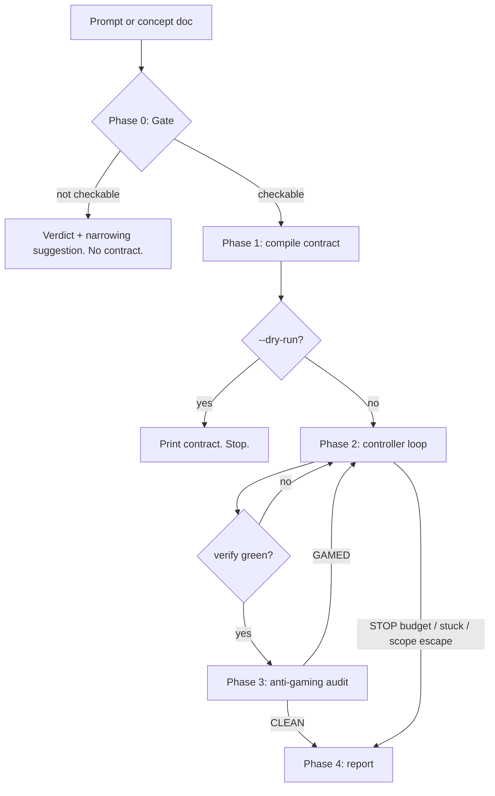

# Loop Contract

Turn a prompt — or a whole concept document — into an explicit loop contract, then execute it autonomously until the contract is satisfied or a budget is exhausted.

**Language:** contract and report follow the language of the user's request. Commit messages, code, and the contract's machine-readable fields stay English.

**This skill writes code.** It edits the working tree inside declared scope fences. It never commits, never pushes, never reverts.

## Control discipline (top-level rule)

**The controller script decides, not you.** Every continue/stop decision comes from `${CLAUDE_SKILL_DIR}/scripts/loop-state.sh`. You spawn workers, run verify commands, and report outcomes to the script. You never conclude "this looks done" or "one more attempt should fix it" — you execute the directive the script prints:

| Directive        | What you do                                                |
| ---------------- | ---------------------------------------------------------- |
| `SPAWN …`        | dispatch one fresh worker subagent for that iteration/item |
| `AUDIT …`        | dispatch the anti-gaming auditor, then report its verdict  |
| `CONTINUE …`     | call `next` again                                          |
| `STOP reason=…`  | stop immediately and write the report                      |
| `SCOPE escape …` | stop the run, report the offending file, change nothing    |

This is a standing rule for the entire run, not a one-time step. The reason is structural: a model asked to judge its own progress will keep retrying a failed action, which is the runaway-loop failure mode this skill exists to prevent.

## Scope

**DOES:**

- Compile a prompt or concept/plan document into a machine-checkable contract.
- Refuse to loop when no checkable done-state exists.
- Run the loop: one fresh worker per iteration or item, deterministic budgets, anti-gaming audit.
- Report what completed, what is blocked, and what was never automatable.

**DOES NOT:**

- Time-based or recurring execution → `/loop <interval>`, `/schedule`.
- Parallel streams or worktree topology → `/atom-operating-model`.
- Judge the quality of the resulting diff → `/branch-review`.
- Write the plan itself → `superpowers:writing-plans` produces plans; this skill executes one.

## Examples

```bash
# Goal-Mode: single checkable goal
/loop-contract entferne alle fetch() calls aus src/, tests müssen grün bleiben

# Plan-Mode: hand over a concept document
/loop-contract docs/superpowers/plans/2026-07-26-di-migration.md

# Inspect the contract without running it
/loop-contract --dry-run migrate every controller to constructor injection

# Raise the global budget for a large concept
/loop-contract docs/plans/big-refactor.md --max-iterations 80
```

## Entry paths

| Entry                                         | Behaviour                                                    |
| --------------------------------------------- | ------------------------------------------------------------ |
| Explicit (`/loop-contract …`)                 | Gate → print contract → **start immediately**                |
| Auto-triggered (matched from a normal prompt) | Gate → print contract → **ask once** → start on confirmation |

An explicit invocation is the consent. An auto-trigger is not: the user did not ask for a loop, so the printed contract plus one `AskUserQuestion` confirmation replaces the review window. Never skip that confirmation on the auto-triggered path.

## Flow



## Phase 0 — Gate

Three checks. Run them before writing anything.

1. **Done-state expressible** — can a shell command be written whose exit code decides the goal?
2. **Progress signal exists** — does something observable change between rounds (failure count, grep hits, items resolved)?
3. **Scope boundable** — can allowed paths be named?

**On failure: no contract, no loop.** Emit the verdict, which check failed, and a concrete narrowing suggestion:

```
VERDICT: not loop-suitable
  ✗ no machine-checkable done-state
  ✗ no progress signal (subjective quality)
No contract written.
Suggest: single-pass + human review, or narrow to "lighthouse a11y score >= 95".
```

Do not soften this into a proxy contract. The Gate is the only runaway defence before execution starts.

**Mode selection:** a document path, or a prompt containing a numbered/checkboxed item list → **Plan-Mode**. Anything else → **Goal-Mode**.

**Plan-Mode applies check 1 per item, not to the plan as a whole:**

- Item has (or implies) a verify command → normal item.
- Item has no command but a structural check exists (file exists, file contains a heading, symbol present) → that becomes its verify.
- Neither → mark the item `manual`. It is never executed and appears in the report as a human todo.

Enter Plan-Mode if at least one item is verifiable. Reject the plan only if every item is `manual`.

## Phase 1 — Compile the contract

Probe the repo before writing the contract: detect the test runner, linter, and build command from `package.json`, `composer.json`, `pyproject.toml`, `Makefile`, or `go.mod`. Never invent a verify command that the project cannot run — run it once, before the loop starts, to confirm it executes at all. A verify command that errors on invocation (rather than failing) is a broken contract, not a red goal.

Write to `outputs/loop-contracts/<slug>.md` (`mkdir -p` first). Full schema and worked examples: [references/contract-schema.md](references/contract-schema.md).

**Print the complete contract before spawning the first worker.** It must be in the transcript so the run is interruptible.

Then initialise the controller:

```bash
# Goal-Mode
${CLAUDE_SKILL_DIR}/scripts/loop-state.sh init --state outputs/loop-contracts/<slug>.state \
  --mode goal --max-iterations 8 --no-progress 2

# Plan-Mode
${CLAUDE_SKILL_DIR}/scripts/loop-state.sh init --state outputs/loop-contracts/<slug>.state \
  --mode plan --per-item 3 --global 40 --items 1,2,3,4
```

Mark unverifiable items immediately:

```bash
loop-state.sh mark --state <state> --item 3 --state-value manual
```

`--max-iterations N` from the user overrides `--max-iterations` (Goal-Mode) or `--global` (Plan-Mode).

## Phase 2 — Run the loop

Preconditions, checked once: not on `main`/`master`/`develop` (abort with a hint), and the verify command executes.

Repeat until the script prints `STOP`:

```bash
loop-state.sh next --state <state>
```

**On `SPAWN`:** dispatch exactly one worker subagent via the Agent tool. Give it: the contract, the item (Plan-Mode), the previous failure output, and the scope fences. Tell it explicitly that it may only touch `scope-allow` paths and must not weaken tests or configuration. Do not carry conversation history into the worker — the fresh context is the point.

**After the worker returns**, in this order:

```bash
loop-state.sh scope-check --allow "src/**,tests/**"       # SCOPE escape → stop the run
<verify command> > /tmp/verify-out.txt 2>&1; echo $?      # capture exit code and output
loop-state.sh record --state <state> --exit <code> --output /tmp/verify-out.txt \
  [--metric <n>] [--item <id>]
```

Pass `--metric` when the contract declares a `progress` command: run it and pass its numeric result (lower is better). Without a metric the script falls back to hashing the verify output — identical output twice means the worker is circling, and that is detected without a model.

Then follow whatever `record` printed. Never run a worker that the script did not ask for.

## Phase 3 — Anti-gaming audit

Fires on every `AUDIT` directive. Dispatch a **separate** subagent with a fresh context that sees only the contract and `git diff` — not the worker's reasoning. It answers one question: satisfied, or circumvented?

Auditor prompt and the circumvention catalogue: [references/anti-gaming.md](references/anti-gaming.md).

Report the verdict back:

```bash
loop-state.sh audit --state <state> --verdict clean|gamed [--item <id>]
```

On `gamed`, append the specific trick to `scope-deny` in the contract file before the next worker spawns. The next worker starts fresh and would otherwise repeat it, having no memory of the previous round.

In Plan-Mode, after `STOP reason=all-items-resolved`, run the contract's `global-verify` and dispatch one final auditor over the whole run diff. Per-item audits each see one item; only the final pass catches an item that quietly broke an earlier one. A failing `global-verify` does not reopen the loop — it is reported as needing a human.

## Phase 4 — Report

Append a run log to the contract file and summarise in the response:

```bash
loop-state.sh report --state <state>
```

Cover: stop reason, iterations or items consumed against budget, `done` / `blocked` / `manual` per item, audit verdicts, files touched, and what needs a human. Name every blocked and manual item explicitly — a silent omission reads as "everything was handled".

Stop reasons and their meaning:

| Reason               | Meaning                                                           |
| -------------------- | ----------------------------------------------------------------- |
| `goal-met`           | verify green, audit clean                                         |
| `all-items-resolved` | Plan-Mode: every item is done, blocked, or manual                 |
| `budget`             | iteration or global cap reached                                   |
| `stuck`              | no progress for `no-progress-rounds` consecutive rounds           |
| `audit-blocked`      | the verifier was gamed twice                                      |
| scope escape         | a file outside `scope-allow` changed; run stopped, nothing undone |

## Rules

- The controller decides; you execute. Never override a `STOP`.
- One turn per run. `allowed-tools` grants expire when the user sends the next message, so complete the loop within the invoking turn rather than pausing mid-run.
- Never commit, never push, never auto-revert. Out-of-scope changes are reported, not undone — silently reverting a user's parallel edit is worse than stopping.
- Refuse to start on `main`/`master`/`develop`.
- A blocked item never aborts a Plan-Mode run. Skip it, record it, continue.
- Never weaken the contract mid-run to reach green. Tightening (`scope-deny` after gaming) is allowed; loosening is not.
- Schema comments and placeholders are author instructions and must not appear in the emitted contract.

## Related skills

- `/loop` (built-in) — recurring or interval-driven execution.
- `/atom-operating-model` — several parallel streams across worktrees.
- `/branch-review` — review the diff this skill produced.
- `/session-handoff` — hand the outcome to the next session.

Optional deterministic auto-triggering via a `UserPromptSubmit` hook: [references/auto-trigger-hook.md](references/auto-trigger-hook.md).
