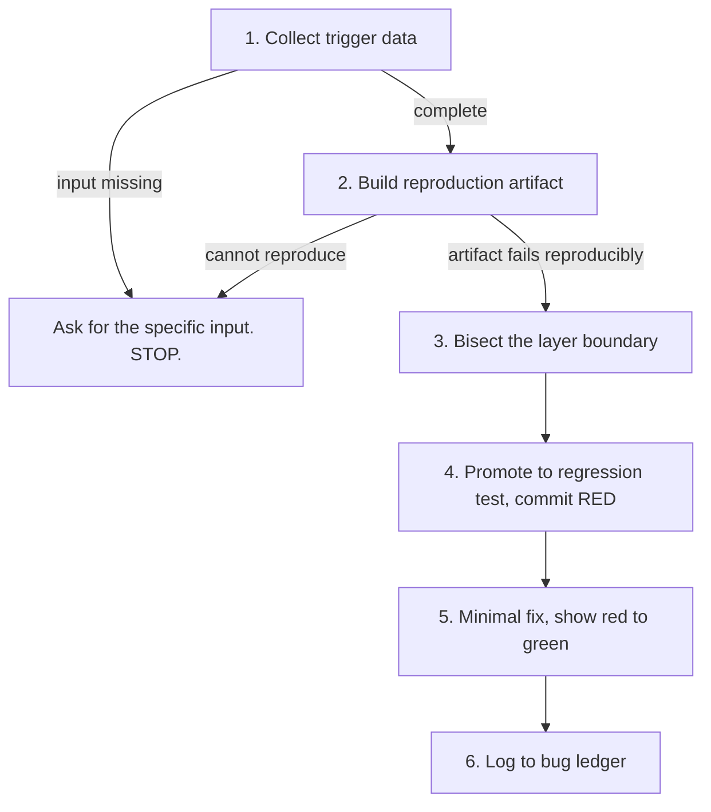

# Reproduce-First Debugging

Force a failing reproduction before any hypothesis, then keep that reproduction forever as a regression test.

## Scope

Covers defect investigation from report to logged root cause: gathering trigger data, building a reproduction artifact, bisecting the broken layer boundary, and promoting the reproduction to a permanent test.

Does **not** cover: implementing features, reviewing diffs, performance profiling without a functional defect, or fixing a defect whose root cause is already confirmed and evidenced — in that case go straight to the fix.

## Examples

```bash
/reproduce-first-debug Promotion code is ignored on the cart page for bundled products
```

```bash
/reproduce-first-debug ABC-1234
```

```bash
# Also triggers on a bare paste, with no question attached:
/reproduce-first-debug TypeError: Cannot read properties of undefined (reading 'total') at CartSummary.vue:42
```

## Workflow



Strict order. No step may be skipped, reordered, or run speculatively in parallel.

### 1. No hypothesis without data

Collect before considering any cause:

- The symptom, stated as observed behaviour, not as a suspected cause.
- The exact trigger inputs: URL, product ID, promo code, order number, command, payload.
- Observed vs. expected, both concrete.

Anything missing: ask for it specifically and stop. Do not guess, and do not start reading code to compensate for a missing input — naming the wrong root cause early costs more than one clarifying question.

### 2. Build the reproduction artifact

The cheapest form that genuinely hits the defect:

- Unit or jsdom test
- `curl` sequence
- SQL against local fixtures
- Dev-only mock
- DOM-faithful HTML mockup

Use local fixtures. Never real ticket or production data.

**Gate: continue only once the artifact reproducibly FAILS and the failing output is pasted.** A reproduction that cannot be made to fail on demand is not a reproduction.

If the defect cannot be reproduced: stop and state precisely which input is needed. Do not propose fixes.

### 3. Bisect the layer boundary

For each layer boundary, prove which side is broken:

> "Client sends the correct PUT; the backend handler is a no-op."

Declare nothing healthy without evidence. `VERIFIED` requires pasted output; anything else is `HYPOTHESIS` and must name the cheapest command that would settle it.

### 4. Reproduction becomes a regression test

Promote the artifact to a permanent test in the suite:

- Named after the ticket
- Committed **separately** and **RED**, before the fix

A reproduction deleted after the fix guarantees the defect can return unnoticed.

### 5. Fix and verify

- Minimal fix — scope stays on the located cause, no neighbouring cleanup.
- New test plus all gates green; show the red-to-green transition with real output.
- Where a target system exists (dev shop, preview URL, live product page), verify the visible behaviour there too, not only in the test suite.

### 6. Log it

Append one row to `docs/bug-ledger.md`, creating the file with this header if absent:

```markdown
# Bug Ledger

| Date | Symptom | Root cause | Layer | Guarding test |
| --- | --- | --- | --- | --- |
| 2026-07-28 | Promo ignored on bundles | Bundle line items skip the discount collector | Backend service | `PromoBundleTest::testBundleGetsDiscount` |
```

## Principles

- A reproduction is the entry ticket to debugging, not an optional first step.
- Evidence or silence: every claim is `VERIFIED` with pasted output, or explicitly labelled `HYPOTHESIS`.
- Never call a mitigation (masking, gate, retry, cooldown) a fix — state what it prevents and what it does not.
- Local fixtures over real data, always.

## Related skills

- `branch-review` — reviewing a diff for defects, rather than investigating a reported one.
- `session-handoff` — capturing the investigation state when a defect outlives the session.
