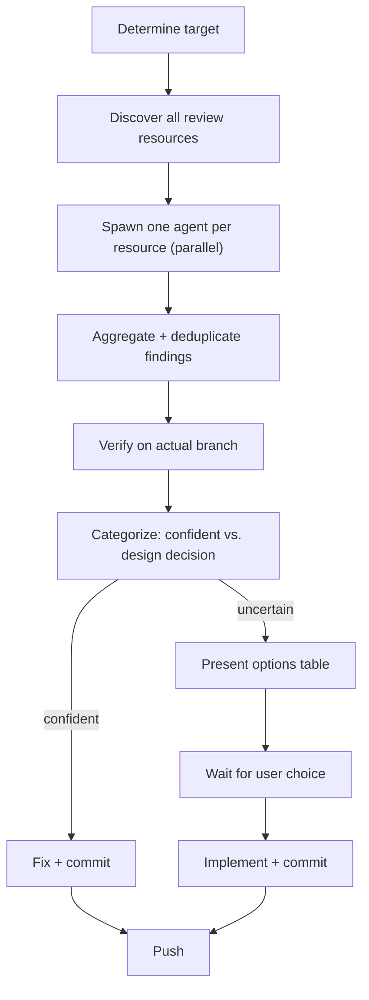

# Review and Fix — Current Branch

Discover every available review skill, agent, and CLI tool at runtime. Launch them all in parallel against the current branch. Fix what's clear, escalate what needs a decision.

## Workflow



## Examples

```bash
# Review current branch (auto-detect PR or diff vs main)
/review-and-fix

# Review a specific PR
/review-and-fix 42

# Review current branch vs a non-main base
/review-and-fix develop
```

---

## Phase 1: Determine Target

**If `$ARGUMENTS` looks like a number**, treat it as a PR number:
```bash
gh pr view "$ARGUMENTS" --json number,title,headRefName,baseRefName
```

**Otherwise**, check if the current branch already has an open PR:
```bash
gh pr view --json number,title,headRefName,baseRefName 2>/dev/null
```

- PR found → target = `pr <number>`, base = PR's baseRefName
- No PR → target = `branch <current-branch>`, base = `$ARGUMENTS` if given, otherwise `main`

```bash
CURRENT_BRANCH=$(git branch --show-current)
```

---

## Phase 2: Discover All Review Resources at Runtime

Before spawning any agents, compile a **review resource list** from three sources. Do this research in parallel using background agents or direct tool calls.

### 2a — Scan available skills

Look at the full list of skills visible in your current session context (the `available-skills` section of the system-reminder). Extract every skill whose **name or description** contains any of:
`review`, `audit`, `check`, `inspect`, `analyze`, `quality`, `security`, `simplif`, `lint`

For each match, record:
- Skill invocation name (e.g. `architecture-review`, `pr-review-toolkit:review-pr`)
- What it focuses on (from its description)
- What arguments it accepts (from argument-hint)

### 2b — Scan available agent types

Check which specialized agent types are available (documented in the Agent tool's subagent_type list). Extract every agent whose description mentions:
`review`, `audit`, `security`, `quality`, `analysis`

For each match, record the subagent_type and its strengths.

### 2c — Probe external CLI tools

Run these checks in parallel:
```bash
command -v coderabbit 2>/dev/null && coderabbit auth status 2>&1 | head -1
command -v semgrep 2>/dev/null && echo "semgrep available"
command -v eslint 2>/dev/null && echo "eslint available"
command -v phpstan 2>/dev/null && echo "phpstan available"
command -v psalm 2>/dev/null && echo "psalm available"
```

Only include tools that are installed **and** authenticated/configured.

---

## Phase 3: Spawn One Agent per Review Resource (All Parallel)

For every resource discovered in Phase 2, spawn one background agent (`run_in_background: true`).

Each agent receives:
- The review target (`pr <N>` or `branch <name>`)
- The base branch
- Its specific instructions: "invoke skill X with these arguments" / "run CLI tool Y" / "use your built-in expertise as subagent_type Z"
- Return format: structured list of findings with `{ description, severity, file, line, confidence }`

**Guidance per resource type:**

| Resource type | How to invoke | What to pass as target |
|---|---|---|
| Skill (accepts `pr <N>`) | `Skill(name)` with args `pr <N>` or `branch <name>` | As documented in argument-hint |
| Skill (no target arg) | `Skill(name)` without args — it reads git state automatically | — |
| Agent subagent_type | `Agent(subagent_type=...)` with a crafted prompt | Include the diff / branch name in the prompt |
| External CLI | `Bash(...)` targeting the branch diff | `--base <base>` or equivalent |

Never skip a discovered resource. The goal is maximum coverage.

---

## Phase 4: Aggregate and Deduplicate

Collect all agent results. For each finding:

- If two or more agents report the **same file + roughly the same issue**, merge into one entry: mark it "confirmed by N agents (X, Y)"
- Sort by severity: Critical → Warning → Info
- Attach the source skill/agent name to every finding

---

## Phase 5: Verify on Branch

For every Critical or Warning finding, verify the issue actually exists in the current branch code:

```bash
git show <branch>:<file>
```

Discard false positives silently. If verification confirms the issue, keep it.

---

## Phase 6: Categorize

**Confident fixes** (apply directly):
- Undefined function calls (runtime crashes)
- DRY violations with an obvious extraction target
- Stale docs/comments contradicting new behavior
- Missing guards that follow established patterns
- Self-referencing loop bugs with a clear fix

**Design decisions** (escalate to user):
- Architecture changes (data flow, endpoint design)
- Multiple valid approaches with trade-offs
- Security hardening scope decisions
- New component extraction vs. inline

---

## Phase 7: Fix Confident Issues

For each confident fix:

1. `git checkout <branch>`
2. Apply fix
3. `git add <files> && git commit` with a descriptive message

Batch related fixes in a single commit. Push all fixes at the end.

---

## Phase 8: Present Design Decisions

For each uncertain finding:

```
### N. <Title>

<One-line problem description>
<Source: skill/agent that reported it>

| Option | Pro | Kontra |
|--------|-----|--------|
| **A: <name>** | ... | ... |
| **B: <name>** | ... | ... |
| **C: <name>** | ... | ... |

**Empfehlung: <X>** — <reasoning in 1-2 sentences>
```

End with: "Welche Optionen soll ich umsetzen? (z.B. 1.B, 2.A, 3.C)"

---

## Phase 9: Implement Choices

After user responds, implement chosen options, commit, and push.

---

## Key Principles

- **Dynamic discovery:** Never hardcode skill or agent names — always discover at runtime
- **Total coverage:** Every discovered review resource runs — no skipping
- **Parallel first:** All review agents launch simultaneously for speed
- **Verify before fixing:** Always `git show` the branch code before claiming a bug
- **Minimal fixes:** Fix only the reported issue — no surrounding refactoring
- **Honest uncertainty:** Multiple valid approaches → escalate, don't guess
- **One commit per concern:** Group related fixes in a single commit
- **Single target:** Always the current branch (or a named PR) — never all open PRs
