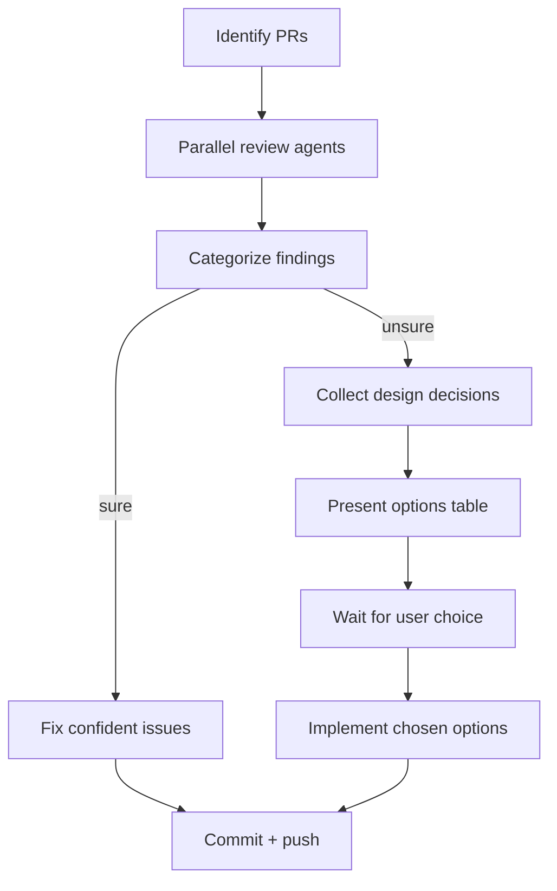

# Review and Fix PRs

Review open PRs, fix what's clear, escalate what needs a decision.

## Workflow



## Examples

```bash
# Review all open PRs
/review-and-fix

# Review a specific PR
/review-and-fix 42

# Review multiple specific PRs
/review-and-fix 42 57 63
```

## Phase 1: Identify PRs

If `$ARGUMENTS` contains PR numbers, use those. Otherwise find all open PRs:

```bash
gh pr list --state open --json number,title,headRefName
```

## Phase 2: Parallel Reviews

Launch one review agent per PR (use `run_in_background: true`). Each agent:

1. `gh pr diff <N>` to read the full diff
2. `gh pr view <N> --json commits` for commit SHA
3. Read all relevant CLAUDE.md files (root + touched directories)
4. Read modified files on the branch via `git show <branch>:<path>`

**Review checklist per agent:**

- CLAUDE.md compliance (DRY, code quality, conventions)
- Bugs (logic errors, race conditions, resource leaks, security)
- Stale comments/docs after behavioral changes
- Git history context (`git blame`, previous PR patterns)

**Ignore:** Style nitpicks, linter/typechecker issues, missing tests, pre-existing issues.

Each agent returns issues with: description, severity, file/line, confidence level.

## Phase 3: Verify Findings

For each reported issue, verify on the actual branch:

```bash
git show <branch>:<file>
```

Discard false positives. Review agents that can't see the branch code produce unreliable results — always verify before acting.

## Phase 4: Categorize

**Confident fixes** (apply directly):

- Undefined function calls (runtime crashes)
- DRY violations with obvious extraction target
- Stale docs/comments contradicting new behavior
- Missing guards that follow established patterns
- Self-referencing loop bugs with clear fix

**Design decisions** (escalate to user):

- Architecture changes (data flow, endpoint design)
- Multiple valid approaches with trade-offs
- Security hardening scope decisions
- New component extraction vs. inline

## Phase 5: Fix Confident Issues

For each confident fix:

1. `git checkout <branch>`
2. Apply fix
3. `git add <files> && git commit` with descriptive message
4. Continue to next fix on same branch

Push all branches at the end.

## Phase 6: Present Design Decisions

For each uncertain finding, present:

```
### N. <Title>

<One-line problem description>

| Option | Pro | Kontra |
|--------|-----|--------|
| **A: <name>** | ... | ... |
| **B: <name>** | ... | ... |
| **C: <name>** | ... | ... |

**Empfehlung: <X>** — <reasoning in 1-2 sentences>
```

End with: "Welche Optionen soll ich umsetzen? (z.B. 1.B, 2.A, 3.C)"

## Phase 7: Implement Choices

After user responds with choices, implement on the respective branches, commit, and push.

## Key Principles

- **Parallel first:** Review all PRs simultaneously, not sequentially
- **Verify before fixing:** Always `git show` the actual branch code before claiming a bug
- **Minimal fixes:** Don't refactor surrounding code. Fix only the reported issue.
- **Honest uncertainty:** If multiple valid approaches exist, escalate. Don't guess.
- **One commit per concern:** Group related fixes in a single commit per branch
